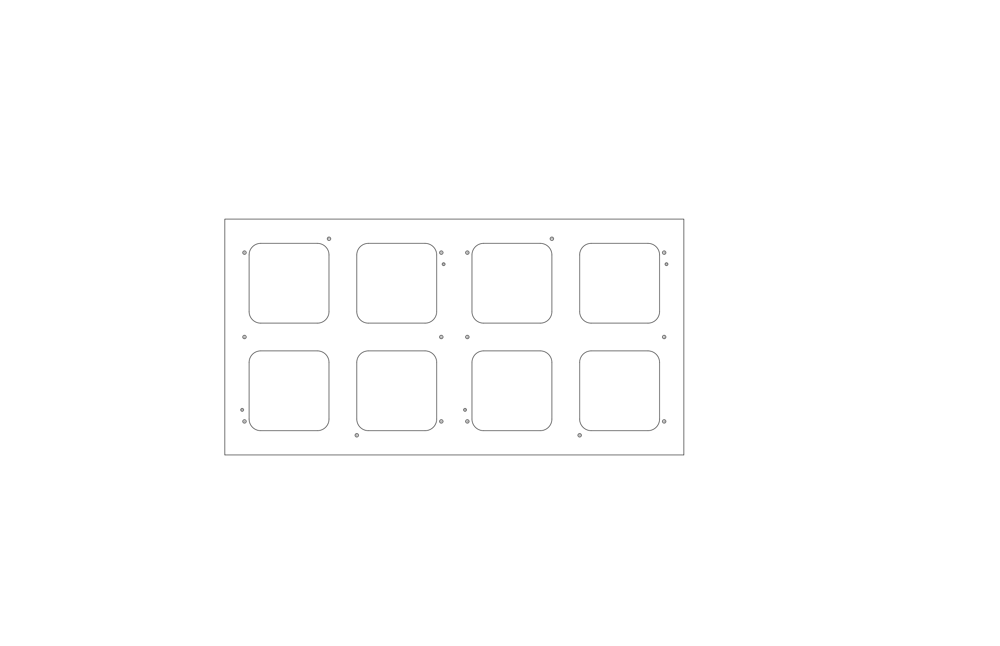

# Hub75Person
A quick-and-dirty Pico app that reads from a [Person Sensor](https://usefulsensors.com/person-sensor/) and displays the results on Hub75 LED panels.

Here's a laser cut plan for a bracket that will hold 2 panels:

